# 🚀 AWS EKS AI Platform
### Production-Grade Kubernetes, Terraform, GitOps & DevOps Automation Platform

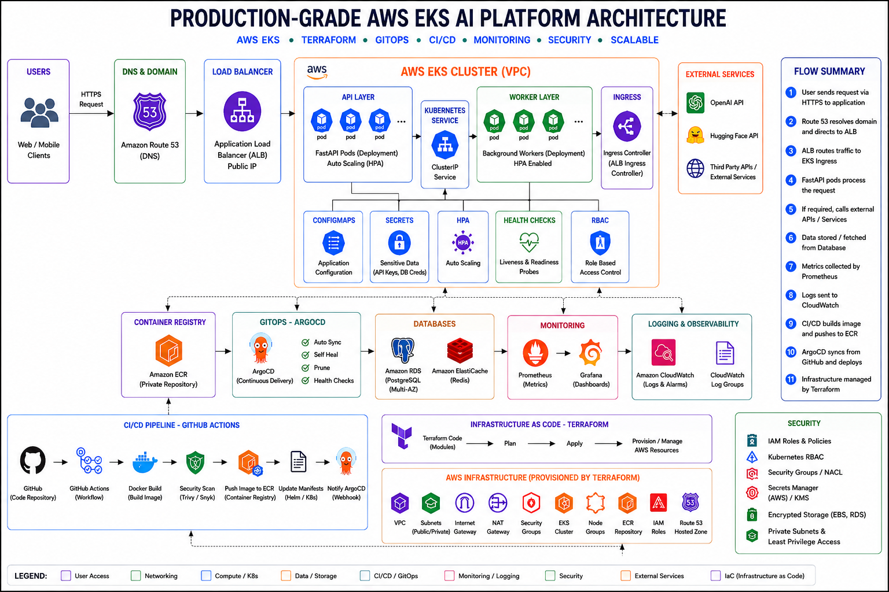

---

# 📌 Project Overview

AWS EKS AI Platform is a production-grade cloud-native infrastructure project that demonstrates modern DevOps engineering, Kubernetes orchestration, Infrastructure as Code (IaC), GitOps deployment automation, CI/CD pipelines, cloud monitoring, and scalable AI service deployment on AWS.

The platform deploys containerized FastAPI AI services on Amazon EKS using Terraform, GitHub Actions, ArgoCD, Helm, Prometheus, Grafana, Amazon ECR, and AWS networking services.

This project follows enterprise DevOps practices used in production environments and showcases end-to-end cloud platform engineering.

---

# 🎯 Project Objectives

The project was designed to demonstrate:

- Kubernetes Administration
- Infrastructure as Code (Terraform)
- GitOps Deployment Automation
- CI/CD Engineering
- Container Orchestration
- AWS Cloud Architecture
- Monitoring & Observability
- Production Deployment Practices
- Scalable Application Deployment
- Enterprise DevOps Engineering

---

# 🏗️ Architecture Overview

The platform follows a GitOps-based deployment model.

```text
Developer
    │
    ▼
GitHub Repository
    │
    ▼
GitHub Actions CI/CD
    │
    ▼
Docker Image Build
    │
    ▼
Amazon ECR
    │
    ▼
ArgoCD GitOps
    │
    ▼
Amazon EKS Cluster
    │
    ▼
FastAPI Application
    │
    ▼
AWS Load Balancer
    │
    ▼
Prometheus Monitoring
    │
    ▼
Grafana Dashboards
```

## Architecture Diagram


---

# ⚙️ Technology Stack

| Category | Technologies |
|-----------|-------------|
| Cloud | AWS |
| Containerization | Docker |
| Container Registry | Amazon ECR |
| Orchestration | Amazon EKS |
| Infrastructure as Code | Terraform |
| GitOps | ArgoCD |
| Package Management | Helm |
| CI/CD | GitHub Actions |
| Monitoring | Prometheus |
| Visualization | Grafana |
| Backend | FastAPI |
| Language | Python |

---

# 📁 Repository Structure

```text
aws-eks-ai-platform
│
├── api/
│   ├── main.py
│   ├── requirements.txt
│   └── Dockerfile
│
├── infra/
│   └── aws/
│       ├── main.tf
│       ├── variables.tf
│       ├── outputs.tf
│       ├── providers.tf
│
├── k8s/
│   ├── namespace.yaml
│   ├── deployment.yaml
│   ├── service.yaml
│   └── hpa.yaml
│
├── helm/
│   └── ai-platform/
│
├── monitoring/
│   ├── prometheus-values.yaml
│   └── README.md
│
├── argocd/
│   └── application.yaml
│
├── images/
│
├── .github/
│   └── workflows/
│       ├── ci-cd.yml
│       └── terraform.yml
│
└── README.md
```

---

# ☁️ AWS Infrastructure

Terraform provisions and manages the complete AWS environment.

## Networking

- Virtual Private Cloud (VPC)
- Public Subnets
- Private Subnets
- Internet Gateway
- NAT Gateway
- Route Tables
- Security Groups

## Kubernetes

- Amazon EKS Cluster
- Managed Node Group
- Kubernetes Namespace
- Kubernetes Deployments
- Kubernetes Services
- Horizontal Pod Autoscaler (HPA)
- Load Balancer

## Container Registry

- Amazon Elastic Container Registry (ECR)

---

# 🏗️ Infrastructure Provisioning

Terraform Infrastructure as Code automates cloud resource provisioning.

### Terraform Workflow

```bash
terraform init
terraform validate
terraform plan
terraform apply
```

### Infrastructure Components

- VPC
- EKS Cluster
- Node Groups
- ECR Repository
- IAM Roles
- Security Groups
- Networking Resources

---

# 🐳 Containerization

The application is packaged as a Docker container.

### Build Image

```bash
docker build -t ai-platform-api .
```

### Push Image to Amazon ECR

```bash
docker tag ai-platform-api:latest <ECR_URI>:latest

docker push <ECR_URI>:latest
```

---

# 🚀 CI/CD Pipeline

GitHub Actions automates the software delivery lifecycle.

## CI/CD Flow

```text
GitHub
   │
   ▼
GitHub Actions
   │
   ▼
Docker Build
   │
   ▼
Amazon ECR
   │
   ▼
ArgoCD Sync
   │
   ▼
Amazon EKS Deployment
```

## Automated Tasks

- Source Code Checkout
- Docker Build
- Image Tagging
- Image Push to ECR
- Terraform Validation
- GitOps Deployment

### GitHub Actions Pipeline

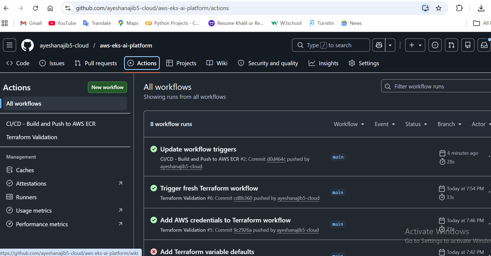

---

# ☸️ Kubernetes Deployment

The application runs on Amazon EKS.

## EKS Cluster

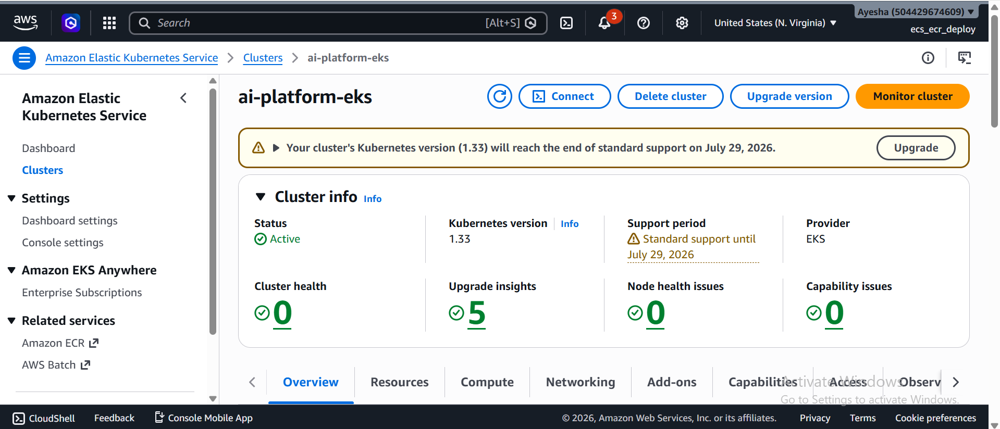

---

## Managed Node Groups

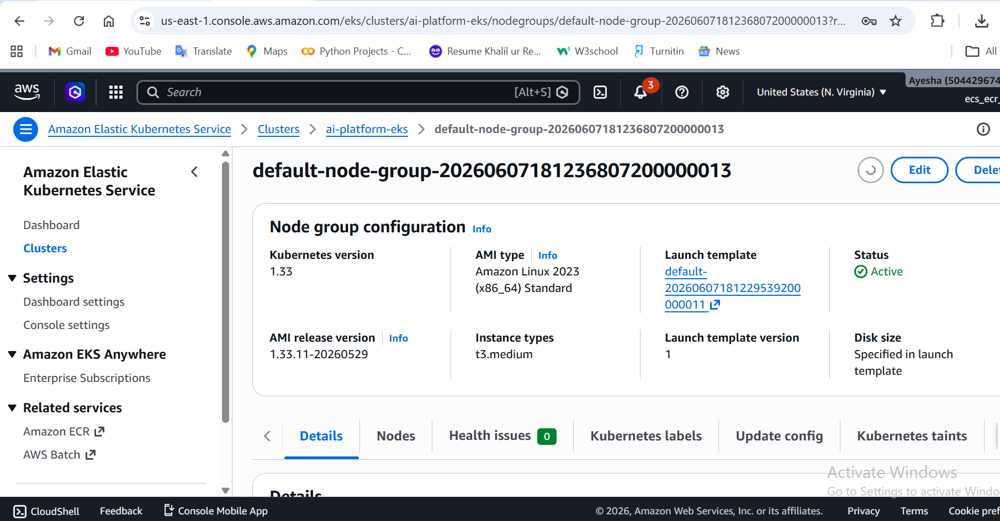

---

## Kubernetes Worker Nodes

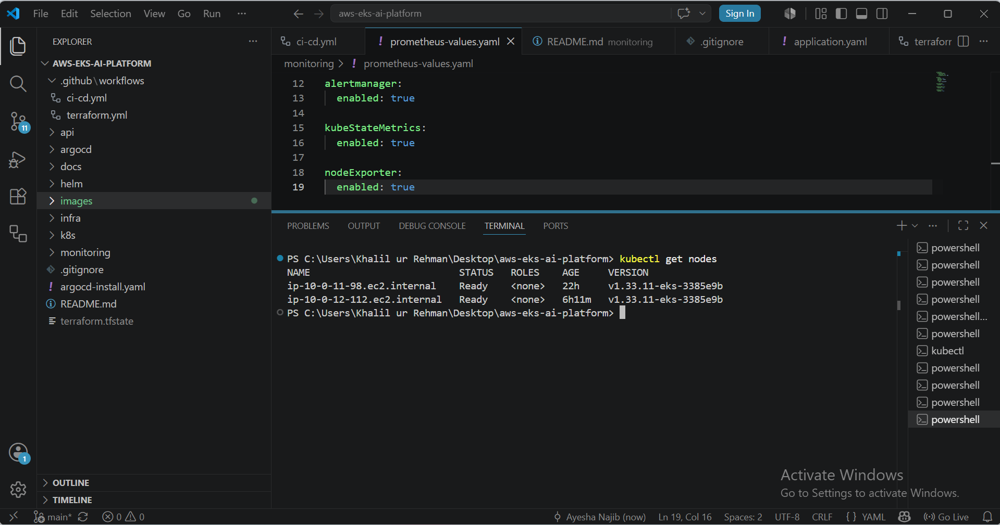

---

## Running Pods

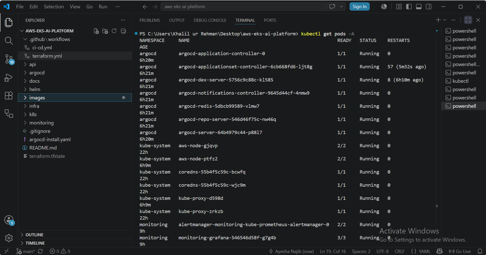

---

# 📦 Helm Deployment

Helm is used to package and deploy Kubernetes resources.

### Deployment

```bash
helm upgrade --install ai-platform ./helm/ai-platform
```

Helm manages:

- Deployments
- Services
- HPA
- Health Checks
- Load Balancer Configuration

---

# 🔄 GitOps with ArgoCD

ArgoCD continuously monitors GitHub repositories and synchronizes desired state with the Kubernetes cluster.

## GitOps Flow

```text
Git Commit
     ↓
GitHub Actions
     ↓
Amazon ECR
     ↓
ArgoCD
     ↓
Amazon EKS
```

### ArgoCD Dashboard

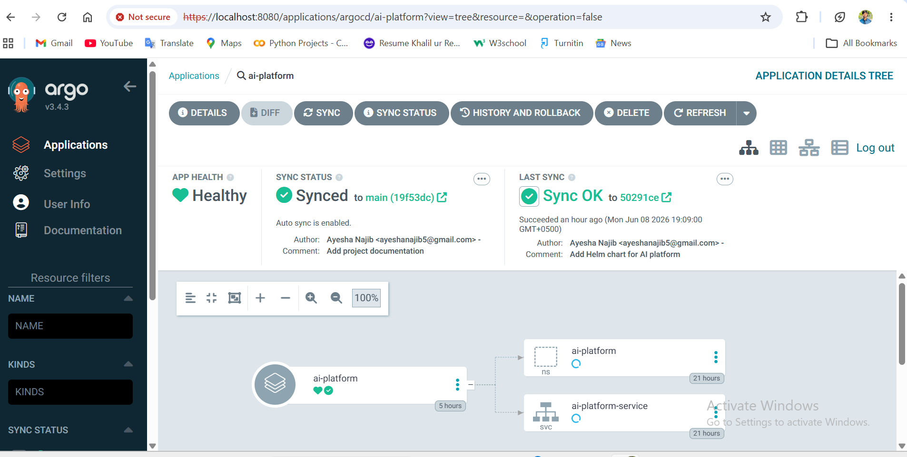

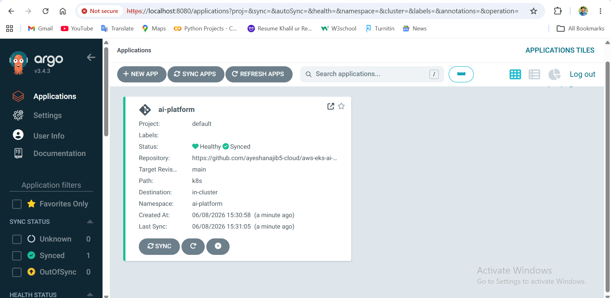

---

# 🌐 Load Balancer

The FastAPI service is exposed externally using an AWS Load Balancer.

## Features

- Public Endpoint
- Traffic Distribution
- High Availability
- Automatic Scaling
- Production Networking

### Load Balancer

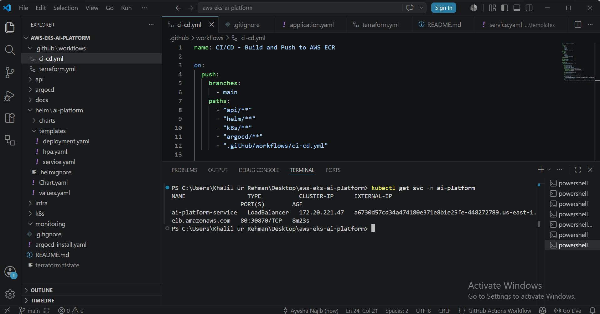

---

# 📊 Monitoring & Observability

The monitoring stack is powered by Prometheus and Grafana.

## Prometheus

Collects:

- Cluster Metrics
- Node Metrics
- Pod Metrics
- Service Metrics
- Resource Utilization

## Grafana

Visualizes:

- CPU Usage
- Memory Usage
- Cluster Health
- Node Health
- Pod Health
- Application Metrics

### Monitoring Pods

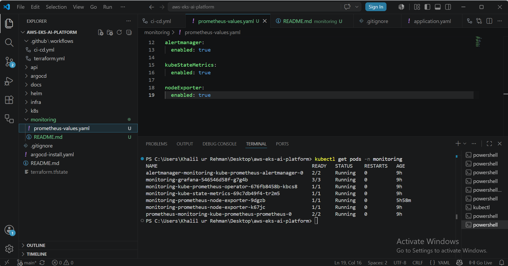

### Grafana Dashboard

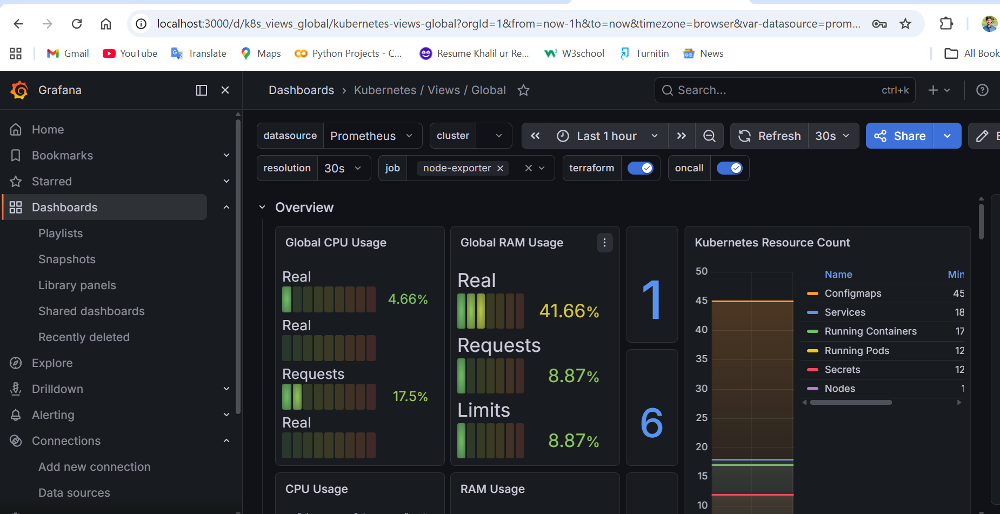

---

# 🔐 Security

Security is implemented across infrastructure and Kubernetes resources.

## AWS Security Controls

- IAM Roles
- Security Groups
- Least Privilege Access
- Kubernetes RBAC
- Secrets Management

## Kubernetes Security

- Namespace Isolation
- Secret Management
- Health Probes
- Controlled Service Exposure

---

# 📸 Project Screenshots

## Architecture Diagram


---

## Repository Structure

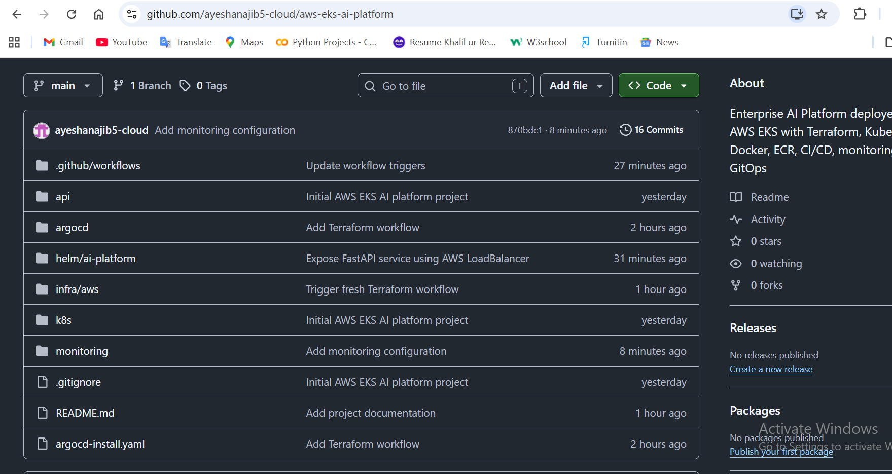

---

## EKS Cluster


---

## Node Groups


---

## Kubernetes Nodes


---

## Running Pods


---

## ArgoCD Dashboard


---

## Monitoring


---

## Load Balancer


---

## CI/CD Pipeline


---

# 🔄 End-to-End System Flow

```text
Developer
    │
    ▼
GitHub Repository
    │
    ▼
GitHub Actions
    │
    ▼
Docker Build
    │
    ▼
Amazon ECR
    │
    ▼
ArgoCD
    │
    ▼
Amazon EKS
    │
    ▼
FastAPI Application
    │
    ▼
AWS Load Balancer
    │
    ▼
End Users
    │
    ▼
Prometheus
    │
    ▼
Grafana
```

---

# 🎓 Learning Outcomes

This project demonstrates practical experience with:

- AWS Cloud Engineering
- Amazon EKS
- Kubernetes Administration
- Terraform Infrastructure as Code
- Docker Containerization
- GitHub Actions CI/CD
- GitOps Workflows
- ArgoCD
- Helm
- Prometheus
- Grafana
- Cloud-Native Deployments
- Enterprise DevOps Engineering

---

# 👩‍💻 Author

**Ayesha Najib**

Cloud Engineer | DevOps Engineer | Kubernetes Enthusiast | AWS Practitioner | Infrastructure Automation | AI Platform Engineering

---